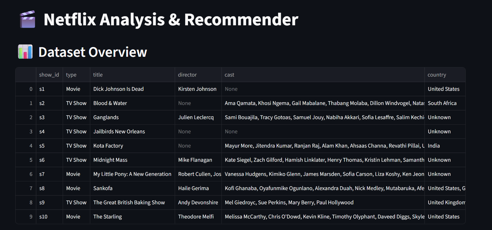
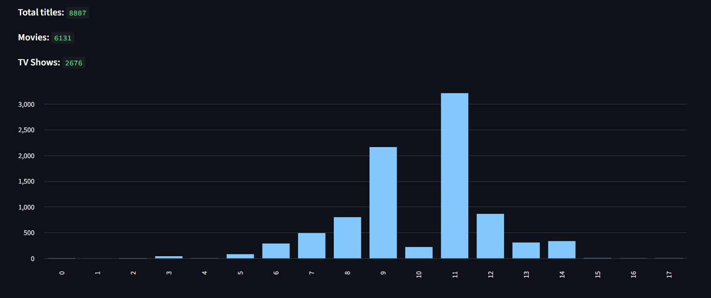
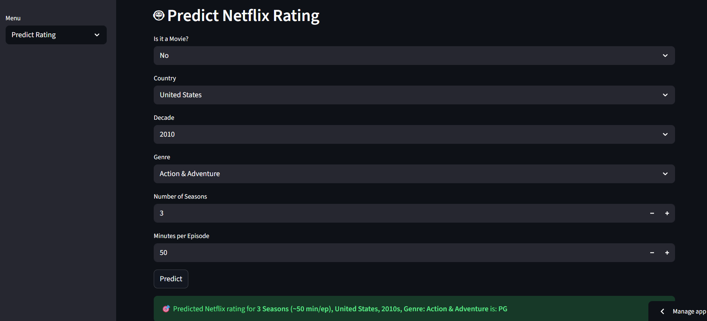
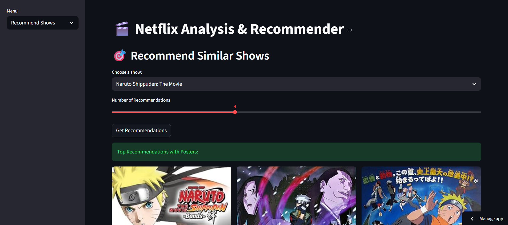
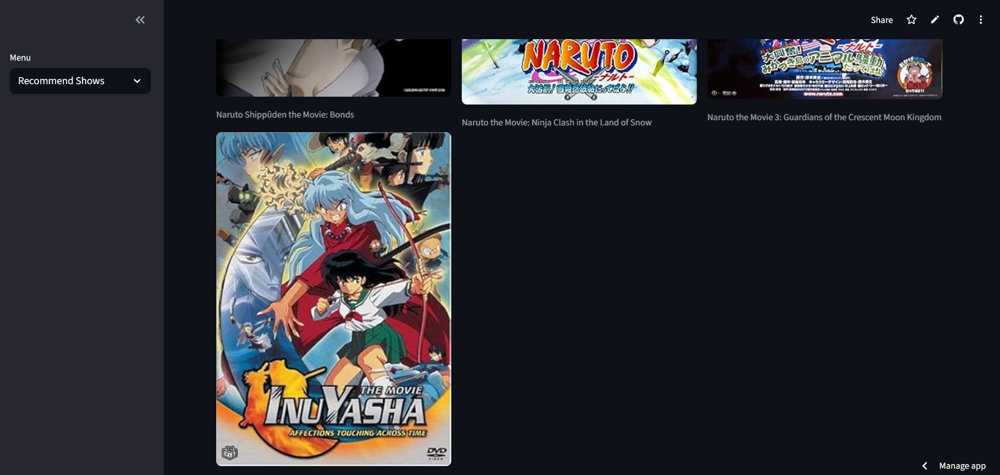

# 🎬 Netflix Data Analysis & Recommendation System

This project analyzes and predicts Netflix content trends while also recommending similar shows and movies.

It includes:

* Data cleaning and visualization
* Machine learning models for content classification
* TF-IDF & Cosine Similarity–based recommender system
* Streamlit app for interactive use

---

## Features

###  Data Analysis

* Cleaned dataset by handling missing values and incorrect entries
* Visualized Netflix content distribution by:

  * Type (Movies vs Shows)
  * Country of release
  * Ratings and release years

* **Random Forest Classifier** used to predict Netflix title ratings
* Other models tested: Logistic Regression, Decision Tree, and XGBoost
* Tuned using GridSearchCV for best accuracy (~53%)

###  Recommendation System

* Built using **TF-IDF Vectorization** + **Cosine Similarity**
* Provides smart recommendations based on:

  * Title name
  * Genre
  * Country
  * Decade

**Posters Included**: Fetch posters via the OMDb API for a visual experience. 

###  Tech Stack

* **Python**
* **Pandas**, **NumPy**, **Matplotlib**, **Seaborn**
* **Scikit-learn**, **XGBoost**
* **Streamlit** for deployment

---

## 🗂️ Project Structure

netflix_project/
│
├── app.py                    # Streamlit app file
├── model/
│   ├── random_forest_model.pkl
│   ├── xgboost_model.pkl
│   ├── tfidf_vectorizer.pkl
│   
├── data/
│   └── netflix_data.csv
├── screenshots 
├── requirements.txt          # Dependencies
└── README.md                 # Project summary

---

## Screenshots / Preview

### Home Page
 

### Predict Rating Page


### Recommend Shows Page
 


##  Installation

1. Clone or download this repository

2. Open terminal inside project folder

3. Install all dependencies:

   ```
   pip install -r requirements.txt
   ```

4. Run the app:

   ```
   streamlit run app.py
   ```

---

## 📊 Results

* **Best Model:** Random Forest
**Predictive Model Accuracy:**  
The Random Forest model achieves approximately **53% accuracy** on the Netflix rating prediction task.  
> Note: Since Netflix ratings are subjective and multiclass, this performance demonstrates the model captures meaningful patterns from limited features (type, genre, country, duration, and decade). The primary focus of the app is the content-based recommendation system.

* **Recommender Example:**

  * Input: *Stranger Things*
  * Output: `[October Faction, Trese, Curon, 46, Good Witch]`

---


## 🧑‍💻 Author

**Prathamesh**
Machine Learning & Deep Learning Enthusiast

---


